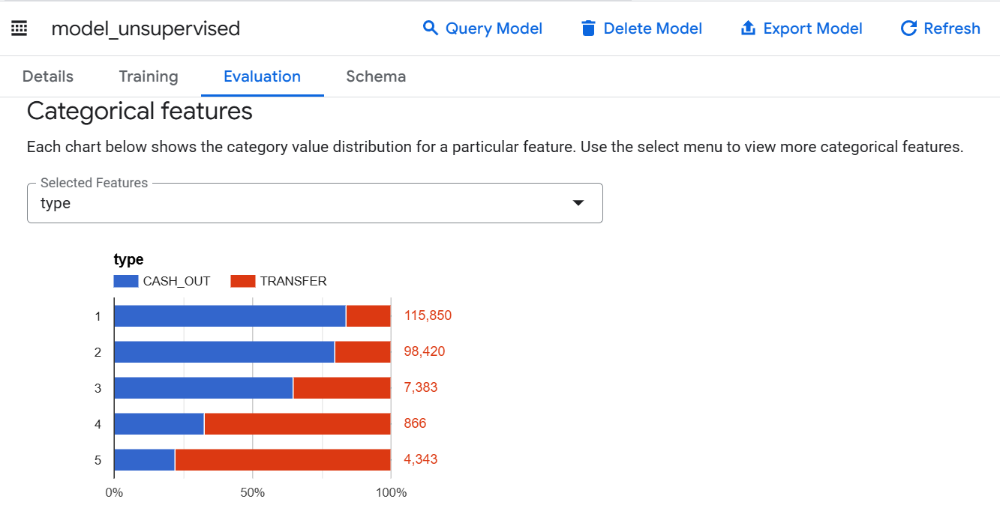
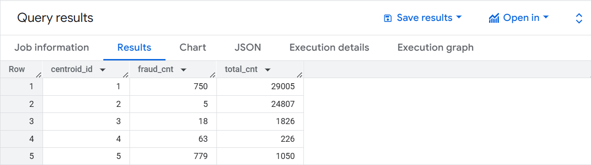

# Fraud Detection on Financial Transactions with Machine Learning on Google Cloud

## Overview
In this project, I explored financial transactions data for fraud analysis and applied feature engineering and machine learning techniques using BigQuery ML to detect fraudulent activities.
- I performed the following steps:
- Loaded raw transactional data into BigQuery.
- Engineered new features to highlight suspicious behavior.
- Trained an unsupervised model (K-Means) to identify anomalies.
- Built supervised models including Logistic Regression and Boosted Tree Classifier to classify fraudulent transactions.
- Evaluated and compared model performance using metrics such as precision, recall, F1-score, and AUC-ROC.
- Used the best-performing model to predict fraud on a hold-out test dataset.

📂 ## Dataset
The dataset was sourced from a public Kaggle competition and included synthetic financial transaction records. It consisted of the following key fields:
- type: Type of transaction (TRANSFER, CASH_OUT, etc.)
- amount: Amount transferred
- nameOrig, nameDest: Sender and recipient account IDs
- oldbalanceOrg, newbalanceOrig: Account balance before and after the transaction (origin)
- oldbalanceDest, newbalanceDest: Account balance before and after the transaction (destination)
- step: Relative time of transaction in hours (from start of a 30-day period)
- isFraud: Target label indicating whether the transaction was fraudulent

The project focused on TRANSFER and CASH_OUT transactions, as these were most associated with fraudulent activity. Feature engineering included creating flags for abnormal balances and errors in transaction amounts to improve model performance.

## ⚙️ Tools / Services
- Google BigQuery
- BigQuery ML
- Google Cloud Storage
- Cloud Shell (for uploading data)

## 📈 Models Trained
### 🌀 Unsupervised
- **K-Means Clustering**: Segments transactions to detect anomalies.

### 🧠 Supervised
- **Logistic Regression**
- **Boosted Tree Classifier**

## 📊 Model Evaluation
- **Metrics:** Accuracy, Precision, Recall, F1-Score, AUC-ROC
- Feature importance retrieved using `ML.WEIGHTS()`
- Model performance compared with `ML.EVALUATE()`

---

## 🧪 Outcome
- Successfully built and deployed fraud detection models using BigQuery ML on financial transaction data.
- Trained both unsupervised (K-Means) and supervised (Logistic Regression, Boosted Tree) models.
- Evaluated models using metrics like precision, recall, accuracy, F1-score, and AUC-ROC.
- Applied the final model to a hold-out test set to predict fraudulent transactions.
- Identified high-risk transactions with fraud probabilities above 50%, focusing on those with >95% predicted likelihood of being fraudulent.
- Enabled efficient fraud screening by surfacing the most suspicious transactions for further investigation.

### K-Means Cluster Fraud Distribution

### Fraud Prediction Results on Test Data

